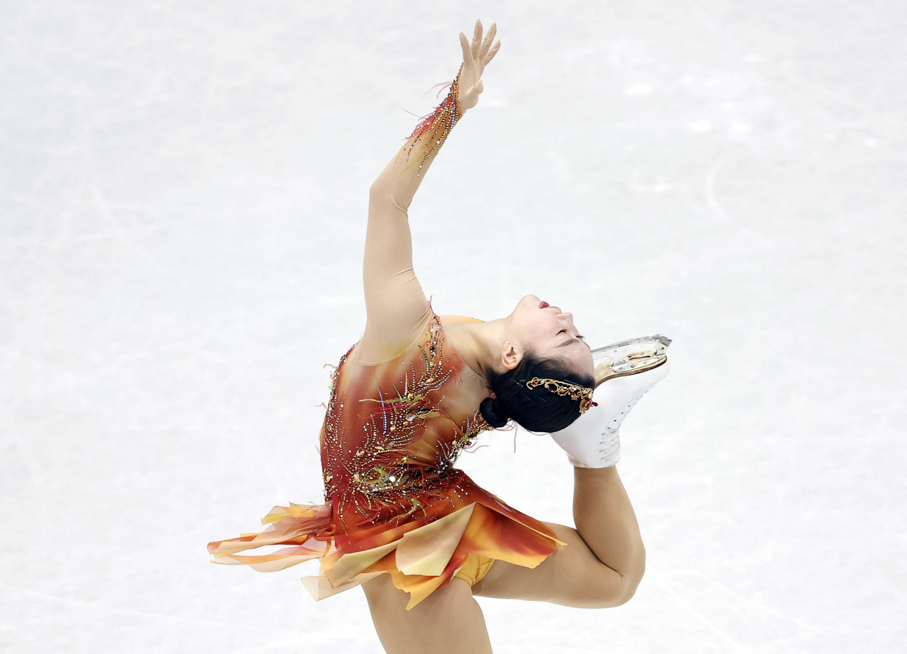

```{r setup, include=FALSE}
knitr::opts_chunk$set(comment = "", warning = FALSE,
                      message = FALSE, tidy = TRUE, size="small")
```

```{r data_setup, include=FALSE}
library(readxl)
library(tidyverse)
library(janitor)
library(tidymodels)
library(dplyr)
library(corrplot)
library(naniar)
library(kableExtra)
library(ranger)
library(xgboost)
library(vip)
library(CGPfunctions)
tidymodels_prefer()

#read in all needed excel sheets
score22 <- read_xlsx("FSScore.xlsx", sheet = '21-22')
score23 <-read_xlsx("FSScore.xlsx", sheet = '22-23')
score24 <- read_xlsx("FSScore.xlsx", sheet = '23-24')
score19 <- read_xlsx("FSScore.xlsx", sheet = '18-19')
score18 <- read_xlsx("FSScore.xlsx", sheet = '17-18')
score17 <- read_xlsx("FSScore.xlsx", sheet = '16-17')

world23 <- read_xlsx("FSScore.xlsx", sheet = 'WC Men 23')
world22 <- read_xlsx("FSScore.xlsx", sheet = 'WC M 22')
world19 <- read_xlsx("FSScore.xlsx", sheet = 'WC M 19')
world18 <- read_xlsx("FSScore.xlsx", sheet = 'WC M 18')
world17 <- read_xlsx("FSScore.xlsx", sheet = 'WC 17')

```

# Introduction

The purpose of this project is to predict the final rankings in the 2024 World Figure Skating Championships for the Men's and Women's Single categories. Figure skating is an Olympic sport where the athlete performs individually, in pairs, or in groups on ice on figure skates. The Olympic disciplines are men's single, women's singles, pair skating, and ice dance, and those are also split within various levels from beginner to senior elite. For this project, we will focus on the senior elite level for men's and women's singles, since they will compete at the World Championships and have the same scoring styles, unlike pair skating and ice dance.

Figure skating competitions at the elite level are held over 2 days where skaters are expected to perform 2 programs, the short program and the free skate (also referred to as the free program), and earn scores for both programs. Their final score is based on the sum of the 2 scores.


## Why?

Typically, fans of the sport might predict the rankings of the World Championships based on a skater's top score or average score of the current season. However, the problem with that is that each event has different sets of judges who may have different consistencies in scoring. A perfect skate at one event can be judged to be full of mistakes at another. Presentation and artistry are also evaluated, which could be subjective. The location of the event could also have an effect on the performance of a skater, like higher elevation could cause poorer performances. Therefore, the average scores of a competition could vary a lot and a winning score at one event could receive a lower score at another.

So, I wanted to see how the variation between competition scores could skew our ideas of the scores during the World Championships!

# Data Description

All scores from International Skating Union recognized competitions are posted on their [website](https://isu.org/figure-skating/entries-results/fsk-results). However it can be messy and have varying formats, so I used [SkatingScores](https://skatingscores.com/), which has the scores in clean, organized tables.

Within a regular figure skating season, there are 9 major ISU events leading up to Worlds: 6 Grand Prix events, a Grand Prix Final where the top 6 skaters during the 6 GP events get to compete, the European Championships, and the 4 Continents Championships. During a Winter Olympic year, the Olympics serve as an extra competition.

No skater will compete at all 9 events. 4 Continents is a competition for nations not part of Europe, so no skater will be competing in both the 4 Continents and European Championships. Grand Prix events are by invite only and skaters can only attend 2 at most. At most, a skater can attend 4 of these competitions or 5 for an Olympic year. At the least but rarely, a skater could not compete at any. So there could be potential missing data there, which we will look into.

I am using data from the 2016-2017, 2017-18, 2018-19, 2021-22, and 2022-23 competitive seasons. I skipped 2019-20 because the World Championships were cancelled due to COVID-19. I also skipped 2020-21 because a lot of events were cancelled also due to COVID, giving me insufficient data. The 2021-22 also did not have a Grand Prix Final event because of COVID, but otherwise there is a sufficient amount of data from that season.

Here is the regular score dataset, where I merged all of the scores from the 9/10 regular competitions over the mentioned seasons. I also added columns specifying the sex of the skater and the competition and the year of the score. I selected the year based on what year the corresponding World Championship competition occurs.

```{r regular_scores}
#merge regular scores
reg_merged <- dplyr::bind_rows(list(score23, score22, score19, score18, score17), .id = 'year')

#add year column
reg_merged <- reg_merged %>% 
  clean_names() %>%
  mutate(year = ifelse(year == 1, 2023,
                ifelse(year == 2, 2022,
                ifelse(year == 3, 2019, 
                ifelse(year == 4, 2018, 2017)))))
#clean skaters
reg_merged$skater <- gsub('[0-9]', '', reg_merged$skater)
reg_merged$skater <- str_squish(reg_merged$skater)

reg_merged %>% 
  kable() %>% 
  kable_styling(full_width = F) %>% 
  scroll_box(width = "100%", height = "200px")
```

I also merged all the score data from the 5 specified World Championships, adding a year variable for the year the Championships took place.

```{r world_scores}
#merge worlds data
worldmerged <- dplyr::bind_rows(list(world23, world22, world19, world18, world17), .id = 'year') 

#clean names
worldmerged$Skater <- gsub('[0-9]', '', worldmerged$Skater)
worldmerged$Skater <- str_squish(worldmerged$Skater)
colnames(worldmerged) <- c('year', 'worldrank', 'skater', 'nation', 'sp_score', 'sp_rank', 'fs_score', 'fs_rank', 'worldscore')

#add year variable
worldmerged <- worldmerged %>% 
  mutate(year = ifelse(year == 1, 2023,
                ifelse(year == 2, 2022,
                ifelse(year == 3, 2019, 
                ifelse(year == 4, 2018, 2017)))))

worldmerged %>%  kable() %>% 
  kable_styling(full_width = F) %>% 
  scroll_box(width = "100%", height = "200px")
```

## Missing Data

Let's explore if there are any missing data in our datasets first. Here is a missing data plot for our regular competition score dataset:

```{r}
reg_merged %>% 
  vis_miss()
```

And for the Worlds dataset:

```{r}
worldmerged %>% 
  vis_miss()
```

There seems to be a lot of missing data within the Free Skate score and rank, and the total score and final rank. Some of this could be because at bigger events, like the European Championships, 4 Continents championships, and Worlds Championships, only the top 24 skaters can advanced to the free skate. This leaves them with no free skate score or rank, and also doesn't count towards their total score since they technically did not finish the competition. Here is an example below from the 2023 European Championships for women, where those ranked below 24 have missing data.

```{r echo=FALSE}
reg_merged %>% 
  filter(competition == 'EC', year == 2023, final_rank > 24, sex == 'Female')%>% 
  kable() %>% 
  kable_styling(full_width = F)
```

A missing final rank could be a skater withdrawing from the competition. An example would be Isabeau Levito during 2023 4 Continents. She did her short program but withdrew after because of sickness and therefore does not get ranked.

```{r}
reg_merged %>% 
  filter(skater == 'Isabeau Levito', competition == '4CC', year == 2023)%>% 
  kable() %>% 
  kable_styling(full_width = F)
```

For the dataset of Worlds score, we see the same issues for missing data; however, I filled in their total score with their short program score if they reached that point since we need it for total World score as the response variable. We can say the free skate score was 0 since they did not get to do it, so their total score is just their short program score and they are ranked based on that. We can see this below with how the Worlds score between 24th and 25th place has a huge drop.

```{r}
#fix missing total score
worldmerged$worldscore <- ifelse(is.na(worldmerged$worldscore), worldmerged$sp_score, worldmerged$worldscore)

#example
worldmerged %>% 
  filter(year == 2018, worldrank <=25, worldrank>=24, skater != "Larkyn Austman") %>% 
  kable() %>% 
  kable_styling(full_width = F) %>% 
  scroll_box(width = "100%", height = "200px")
```

## Tidying Data

First, I decided that I would separate average short program score and average free skate score, rather than just using average total score, for my analysis. This is because sometime skaters can do better in one program compared to the other. Free skates allow for higher scores to be earned, so if a skater typically falters during a free skate, we would like to see that reflected. It also helps our missing data problem, where any missing free skate scores won't have too much of an effect as long as the skater has another free skate score in the season or the skater doesn't reach the free skate during Worlds.

So I added 2 columns into the regular competition score data set that holds the average scores for each skater for that season. Then I pivoted the dataframe so that each competition has its own column and is marked 1 if the skater attended the event that season and a 0 if not. Finally, I merged the regular score dataframe with the Worlds score dataframe, dropped unneeded columns, and finally got for each season, each skater has one row with their name, the ending year of the season as a factor, their sex, their short program average, their free program average, factor variables that tells us which competition they went to in the season, and for the response variable for our predictions: their score at Worlds that year.

```{r final_data}
#take averages
avg <- reg_merged %>% 
  group_by(skater, year) %>% 
  mutate(spavg = mean(sp_score,na.rm = TRUE)) %>% 
  mutate(fpavg = mean(fs_score, na.rm=TRUE)) %>% 
  mutate(tsavg = mean(total_score, na.rm=TRUE)) %>%
  select(skater, year, competition, spavg, fpavg, tsavg, sex)

#pivot competition variable
avg$truth <- 1
pivoted <- avg %>% 
  pivot_wider(names_from = competition, values_from = truth)
pivoted[is.na(pivoted)] <- 0

#drop unneeded columns in worldmerged
worldmerged <- worldmerged %>% 
  select(year, skater, worldscore, worldrank)

#for graphing later on
graphdata <- merge(worldmerged, pivoted, by = c('skater', 'year'))
graphdata$tsavg <- ifelse(graphdata$tsavg==0, graphdata$spavg, graphdata$tsavg)

#final dataframe for analysis
data <- graphdata %>% 
  select(-tsavg, - worldrank) %>% 
  mutate(year = as.factor(year))

#factor competition variables
for (i in c(7:19)) {
  data[, i] <- factor(data[, i])
}

data %>% kable() %>% 
  kable_styling(full_width = F) %>% 
  scroll_box(width = "100%", height = "200px")

```

### Codebook

Here are the final variables I have selected to use in my dataframe for analysis:

-   `skater`: The skater's full name

-   `year`: the ending year of the season that the competitions are a part of

-   `worldscore`: the total score of the skaters in the World Championships competition

-   `spavg`: a skater's average short program score within that season

-   `fpavg`: a skater's average free program score within that season

-   `sex`: the skater's sex. Male or Female.

-   The competition variables: the event name abbreviation. A 1 indicates that the skater attended the event that season, and a 0 indicates that they did not. The abbreviations are as follows:

    -   GPUSA: Grand Prix Skate America

    -   GPCAN: Grand Prix Skate Canada

    -   GPFRA: Grand Prix de France

    -   GPCHN: Grand Prix Cup of China

    -   GPFIN: Grand Prix Espoo/Helsinki

    -   GPJPN: Grand Prix NHK Trophy

    -   GPGBR: Grand Prix MK John Wilson Trophy

    -   GPITA: Grand Prix Gran Premio d'Italia

    -   GPRUS: Gran Prix Rostelecom Cup

    -   GPF: Grand Prix Final

    -   EC: European Championships

    -   4CC: 4 Continents Championships

    -   OLY: Olympics

# EDA

## Scores Across Sexes

Let's take a deeper look into the different variables. The first thing to note is that Men's Singles tend to have higher score than Women's because of the difference in difficulties between the categories. We can see that reflected in the histograms below, where we see the distribution of the Worlds Total scores between the 2 sexes. We can see their distribution between the 2 sexes differ a lot, so it is important during our analysis that we differ the 2 sexes from each other.

```{r, message=FALSE, warning=FALSE}
            
data %>%   
  ggplot(aes(x = worldscore, color = sex)) + 
  geom_histogram(alpha = 0.5, aes(fill = sex), position = 'identity')+
  labs(title = 'Scores Between Sexes at Worlds', x = 'Total Scores')+
  theme_bw()
```

We can see how the data clusters between those that did both the free and short program at Worlds, and those that did not qualify to the Free Program. For those that only participated in the short program, men seems to have a peak at around a score of 60, while women peak at around 50. For those that participated in both segments, we can see the bulk of the women's score ranging from about 150 to 200, while the bulk of the men's ranges from about 225 to 260. There is no limit to figure skating scores, but the world record in total scores for women's is 272.71 and for men's is 335.3, so we will expect those to be the maximum scores for the data we have.

## Average Scores Across Years and Sexes

There is also a difference in the spread of scores between years for both segments. We can see the change in distribution between years for average short program scores and average free program scores below. For the free program scores, I filtered out any missing free program scores that were filled in as 0 so that we can get a more accurate look at the differences in scoring for the free program.

```{r}
data %>%
  ggplot(aes(x = year, y = spavg, group = year, color = sex)) +
  geom_boxplot(fill = 'grey')+
  facet_wrap(~sex)+
  labs(title = 'Distribution of Avg. SP Score Between Years and Sexes', y = 'SP Score Averages', x = 'Year')+
  theme_bw()
data %>%
  filter(fpavg != 0) %>% 
  ggplot(aes(x = year, y = fpavg, group = year, color = sex)) +
  geom_boxplot(fill = 'grey')+
  facet_wrap(~sex)+
  labs(title = 'Distribution of Avg. FS Score Between Years and Sexes', y = 'FS Score Averages', x = 'Year')+
  theme_bw()
```

Figure skating has a lot of rule changes throughout the years, and these rule changes affect how a skater is able to earn points. Sometimes it might be easier for them to earn a few extra points or sometimes it could be harder to get an extra point boost over other skaters. These changes can be reflected in how the distribution of scores vary throughout the years, and it is why we should look at how the year affects a skater's score. We can also see that average free program score varies more throughout the years compared to short program scores. The short programs have more rigorous rules that restricts a skater's score-earning potential and the free program is when it is more open to point-earning but also the most affected by rule changes.

## Number of Competitors

Different competitions have different amounts of competitors and ways to qualify for them. The 6 Grand Prix events are invite-only, usually allowing 10 to 12 competitors for each for Men's and Women's. A skater can be invited to 1 or 2 of these events. On top of those 6 events, the Grand Prix Final has the top 6 skaters for each gender in the GP events compete against each other. The 4 Continents, European Championships, and Olympics allow each ISU-recognized nation to have at least 1 skater enter the competition. A nation could earn up to 3 spots based on previous performances at other events. A skater also needs to have a minimum technical score (a component of their score for a program) to enter. Because of all of these rules, these 3 events can have varying amounts of competitors in them. We can see this broken down below with the number of competitors in each competition for the 2022 season.

```{r}
reg_merged %>% 
  filter(year == 2022) %>% 
  ggplot(aes(y= competition))+
  geom_bar(aes(fill = sex))+
  facet_wrap(~sex)+
  labs(title = 'Number of Competitors')+
  theme_bw()
```

## Scores Across Competitions

As mentioned before, there is a discrepancy with scoring between different competitions. Let's take a look at the scores from the 2022-2023 season so we can see how the spread and median of scores differ.

```{r message=FALSE, warning=FALSE}
reg_merged %>% 
  filter(year == 2023) %>% 
  ggplot(aes(x = competition, y = total_score, color = sex)) +
  geom_boxplot(fill = 'grey')+
  geom_jitter(alpha = 0.4)+
  facet_wrap(~sex)+
  labs(title = 'Distribution of Score across 2022-23 Competitions', x = 'Competition', y = 'Total Score')+
  theme_bw()+
  theme(axis.text.x=element_text(angle=90,hjust=1))
```

All the competitions have differing medians and ranges of scores. A popular fan opinion for this season was that GP Japan was relatively easy on the scoring, so a lot of mistakes weren't called to deduct from a skater's points. This can be reflected with a higher median score compared to the other GP events across both sexes.

## Average Total Score vs. World Score

It is also important to understand that average total score is not a good predictor of a skater's score at the World Championship. The graphs below show World Score on the x-axis and average Total Score on the y-axis by year and sex. If average Total Score was the sole predictor of World Score, we would see the graphs with only positive sloping lines; however, that is not the case. Someone with a higher average score could score lower than someone with a lower average score. That is why we need to look at other variables that could affect a skater's scores throughout the season and at Worlds.

```{r}
graphdata %>% 
  ggplot(aes(x = worldscore)) +
  geom_line(aes(y=tsavg, color = sex))+
  labs(x = 'World Score', y = 'Average Total Score', title = 'Average Total Score vs. World Score')+
  facet_wrap(~year)+
  theme_bw()
```

# Setting Up Models

## Data Splitting

Our first step before fitting any models is to split our data into 2 sets, the training and testing set. The training set we will use to fit our model onto and the testing set is used to see how well our models will perform with unseen data. I chose a 70/30 split, where 70% of the data will go into the training set and 30% into the testing set. I also stratified the split on the response variable, `worldscore`, so that we get an even distribution of the variable in both sets, which is especially useful since we have that big gap in scores between the 24th and 25th place at Worlds, as mentioned before.

```{r}
set.seed(1012) # for reproducibility

# 70/30 split, stratify on world_rank
scores_split <- initial_split(data, prop = 0.7, strata = worldscore)

score_train <- training(scores_split)
score_test <- testing(scores_split)
```

Let's check the dimensions for the training dataset:

```{r}
dim(score_train)
```

And the testing dataset:

```{r}
dim(score_test)
```

The training set has 223 observations while the testing set has 96. This looks about right for our 70/30 split.

## Building Recipes

Now we will build a recipe with our predictor and response variables to use for the models we will create. We can make one universal recipe, since we will use the same predictors and response for each model. We want to use all of the variables in our dataset, except for the skater's name, and have `worldscore` be our response variable. We also want to make sure we turn any nominal variables into dummy variables, which indicates the presence or absence of a certain level of the nominal variable with either a 0 or 1. Lastly, we will also normalize our data, since the ranges of `spavg` and `fpavg` vary. Below is our recipe:

```{r}
# Create Recipe
score_recipe <- recipe(worldscore ~ ., data = score_train) %>% 
  step_rm('skater') %>% 
  step_dummy(all_nominal_predictors()) %>% 
  step_normalize()
```

## K-Fold Cross Validation

Next, we will prepare our data for k-fold cross validation. K-fold cross validation will split our training data into *k* subset or folds. One fold will be set aside, while the models we create will be fit on to the remaining *k-1* folds. Then the fitted models will be tested on the fold that was set aside. We will repeat these steps *k* times, making sure to have a different fold be set aside each time. In the end, we will take the average of the model performance metrics from the testing fold to see how well the model performs on the training data.

K-fold cross validation allows a more accurate evaluation of a model's performance since we are fitting and evaluating the model on multiple different splits. We measure multiple performance metrics and take an average rather than just measuring one metric.

For our analysis, we will use 10 folds. Below, we are splitting our training data into 10 folds while also stratifying on our response variable, `worldscore`, to make sure there is a balanced distribution of the variable between the different folds.

```{r}
score_folds <- vfold_cv(score_train, v = 10, strata = worldscore)
```

# Model Fitting

Now we will build our model and fit them onto the data. I will be fitting 5 different types of models: K-nearest neighbors, linear regression, elastic net, random forest, and gradient-boosted tree. For each model, we will be following these steps:

1.  Set up the model, tuning for any parameters that are needed. Add the engine and specify regression mode if needed.

2.  Set up the workflow, adding the model and recipe.

3.  Create tuning grid if there are any tuning parameters. Specify the range and levels of these parameters.

4.  Tune the model with the workflow, cross-validation flows, and the tuning grid.

5.  Save the tuned models to a RDS file and later, load back in the saved files. This will help us save time from continuously rerunning any time-consuming models.

## K-Nearest Neighbors

K-nearest neighbors is a non-parametric model that measures the distance between data points to make predictions. It selects *k* nearest data points to the new data point we are trying to predict and averages the data points to predict the outcome of the new data. To choose *k*, we will tune it and choose the best performing *k* from a range of 1 to 10 with 10 levels.

```{r eval=FALSE}
##K-nearest neighbors

#set up model, tuning for neighbors parameter
knn_model <- nearest_neighbor(neighbors = tune()) %>% 
  set_mode('regression') %>% 
  set_engine('kknn')

#set up workflow and add model and recipe
knn_workflow <- workflow() %>% 
  add_model(knn_model) %>% 
  add_recipe(score_recipe)

#set up grid
knn_grid <- grid_regular(neighbors(range = c(1, 10)), levels = 10)

#tune model
knn_tune <- tune_grid(
  object = knn_workflow,
  resamples = score_folds,
  grid = knn_grid
)

#save models
write_rds(knn_tune, file = 'tuned_models/knn.rds')
```

## Linear Regression

Linear regression is one of the most simple models, creating a linear relationship between the response variable and the predictor variables. It is not very flexible but it is easy to use and understand. There are no parameters to tune, so after setting up our workflow, we can skip right into fitting the model onto the folds.

```{r}
##Linear regression

#set up model
lm_model <- linear_reg() %>% 
  set_engine('lm')

#set up workflow
lm_workflow <- workflow() %>% 
  add_model(lm_model) %>% 
  add_recipe(score_recipe)

#no tuning for linear regression, so we will skip into fitting the model onto the cross validation folds
lm <- fit_resamples(lm_workflow, resamples = score_folds)
```

## Elastic Net

Elastic Net combines the regularization techniques of Lasso regression (shrinking irrelevant variables to 0) and Ridge regression (shrinking some variables to smaller numbers but not 0). This will help us get rid of irrelevant variables and also fix any multicollinearity problems. The model has 2 parameters: `mixture` which tells us what proportion of Lasso regularization is used in the model (0 for only Ridge regression, 1 for only Lasso), and `penalty` which tells us the overall level of regularization in the model. We will tune these 2 parameters on a range of 0 to 1 for `mixture` and 0 to 3 for `penalty`, each with 10 levels.

```{r eval=FALSE}
##Elastic net

#set up model, tuning for penalty and mixture
en_model <- linear_reg(mixture = tune(), penalty = tune()) %>%
  set_engine("glmnet") %>% 
  set_mode("regression")

#set up workflow
en_workflow <- workflow() %>%
  add_model(en_model) %>% 
  add_recipe(score_recipe)

#set up grid
en_grid <- grid_regular(penalty(range = c(0,3), trans = identity_trans()), mixture(range = c(0,1)), levels = 10)

#tune model
en_tune <- tune_grid(
  object = en_workflow,
  resamples = score_folds,
  grid = en_grid
)

#save model
write_rds(en_tune, file = 'tuned_models/en.rds')
```

## Random Forest

A Random Forest model creates multiple decision trees that are each trained on a random subset of training data with a random subset of predictors. The predictions of all the trees are averaged to make predictions on new data. The model was 3 parameters: `mtry` which tells us the number of predictors that are randomly sampled at each split, `trees` which tells us the number of trees we want to create in the Random Forest, and `min_n` which tells us the minimum number of observations in the data sample that is required for the tree to continue splitting. We are tuning these parameters, with `mtry` allowed a range of 1 to 17 (the total number of predictors we have), `trees` gets a range of 200 to 500, and `min_n` gets a range of 8 to 13.

```{r}
## Random Forest

#set up model, tuning for mtry, trees, min_n
rf_model <- rand_forest(mtry = tune(),
                        trees = tune(),
                        min_n = tune()) %>% 
  set_engine('ranger', importance = 'impurity') %>% 
  set_mode('regression')

#set up workflow
rf_flow <- workflow() %>% 
  add_model(rf_model) %>% 
  add_recipe(score_recipe)

#set up grid
#rf_grid <- grid_regular(mtry(range = c(1, 17)),
                        #trees(range = c(200, 500)),
                        #min_n(range = c(8, 13)), levels = 10)

#tune model
#rf_tune <- tune_grid(
  #object = rf_flow,
  #resamples = score_folds,
  #grid = rf_grid)

#save model
#write_rds(rf_tune, file = 'tuned_models/rf.rds')
```

## Gradient-Boosted Tree

Gradient-Boosted Trees sequentially build trees based on the residuals of a model, rather than the outcome variable. It adds new trees to update the residuals of the previous trees so that it eventually minimizes overall error. We will again tune the parameters `mtry` and `trees` with the same range, but this time we will tune `learn_rate` rather than `min_n` since it has a bigger impact on the performance of the model. We gave `learn_rate` a range of 0.01 to 0.1 with 10 levels for each of the parameters, which tells us the rate that the boosted tree will learn.

```{r eval=FALSE}
##Gradient-boosted tree

#set up model, tuning for mtry, tress, learn_rate
gbt_model <- boost_tree(mtry = tune(),
                        trees = tune(),
                        learn_rate = tune()) %>% 
  set_engine('xgboost') %>% 
  set_mode('regression')

#set up workflow
gbt_flow <- workflow() %>% 
  add_model(gbt_model) %>% 
  add_recipe(score_recipe)

#set up grid
gbt_grid <- grid_regular(mtry(range = c(1, 17)),
                         trees(range = c(200, 500)),
                         learn_rate(range = c(0.01, 0.1)),
                         levels = 10)

#tune model
gbt_tune <- tune_grid(
  object = gbt_flow,
  resamples = score_folds,
  grid = gbt_grid
)

#save model
write_rds(gbt_tune, file = 'tuned_models/gbt.rds')
```

# Model Results

With all of our models competed and saved, lets load back in the saved results and analyze their performance.

```{r}
#K Nearest Neighbors
knn <- read_rds(file = 'tuned_models/knn.rds')

#Linear model saved under lm variable

#Elastic Net
en <- read_rds(file = 'tuned_models/en.rds')

#Random Forest
rf <- read_rds(file = 'tuned_models/rf.rds')

#Boosted Trees
bt <- read_rds(file = 'tuned_models/gbt.rds')
```

To analyze the performances of the models, I will use Root Mean Square Error (RMSE) as my performance metric. RMSE is a common measure of a regression model's performance, showing us how far away the model's predicted value is from the data's true value. A better performing model will have a lower RMSE, telling us that the predicted values are closer to the true values. The RMSE value we will be comparing is the average RMSE across the our cross-validation folds. We will begin by comparing the models we tuned and see which values for the parameters we tuned worked the best based on RMSE.

## Best Parameters

### K-Nearest Neighbors

Let's take a look at which K-Nearest Neighbors model performed the best. Below, we can see a graph of the RMSE for each *k* value. The best performing *k* value is the one with the lowest RMSE, which looks to be *k = 10*

```{r}
autoplot(knn, metric = 'rmse')
```

### Elastic Net

Next, let's take a look at the RMSE for the Elastic Net model. The x-axis shows the penalty, the different colored lines show the mixture, and the y-axis shows the RMSE. In general, when the penalty and mixture is higher, the RMSE is lower and the model performs better.

```{r}
autoplot(en, metric = 'rmse')
```

### Random Forest

Now, let's look at the RMSE for the Random Forest model. The x-axis shows the mtry, the different colored lines show the number of trees, and the y-axis shows the RMSE. In general, when the value for mtry was higher, the RMSE is lower and the model performs better.

```{r}
autoplot(rf, metric = 'rmse')
```

### Gradient-Boosted Tree

Finally, let's take a look at the RMSE for the Gradient-Boosted Tree model. The x-axis shows the mtry, the different colored lines show the number of trees, the different graphs show the learning rate, and the y-axis shows the RMSE. Across the parameters, there doesn't seem to be a pattern of which level of the parameters performed the best.

```{r}
autoplot(bt, metric = 'rmse')
```

## Best Models

Now that we get a general sense of which parameters worked best, let's compare the different types of models with each other. We will use the function `show_best` to choose the best model based on the lowest RMSE value. Below are the tables showing the best performing models for each type. The variable `mean` is the mean RMSE value across the cross-validation folds, and the variable `std_err` is the standard deviation of the RMSE values.

```{r}
#K-nearest Neighbors
knn_best <- show_best(knn, metric = 'rmse', n =1)

knn_best %>%
  kable(caption = 'Best K-nearest Neighbors Model') %>% 
  kable_styling(full_width = F, position = "left")

#Linear Regression
lm_best <- collect_metrics(lm)[1,]

lm_best %>%
  kable(caption = 'Linear Model') %>% 
  kable_styling(full_width = F, position = "left")

#Elastic Net
en_best <- show_best(en, metric = 'rmse', n =1)

en_best %>%
  kable(caption = 'Best Elastic Net Model') %>% 
  kable_styling(full_width = F, position = "left")

#Random Forest
rf_best <- show_best(rf, metric = 'rmse', n =1)

rf_best %>%
  kable(caption = 'Best Random Forest Model') %>% 
  kable_styling(full_width = F, position = "left")

#Boosted Tree
bt_best <- show_best(bt, metric = 'rmse', n =1)

bt_best %>%
  kable(caption = 'Best Gradient-Boosted Tree Model') %>% 
  kable_styling(full_width = F, position = "left")
```

We can also compare the other models visually by plotting their mean RMSE values and the standard deviation.The graph below for the mean RMSE and the standard deviation for the models on the y-axis and the different models on the x-axis.

```{r}
#combine RMSE and standard deviation for each model into a dataframe
rmse <- rbind(knn_best %>% select(mean, std_err) %>% mutate(model = 'KNN'), 
              en_best%>% select(mean, std_err)%>% mutate(model = 'Elastic Net'),
              rf_best%>% select(mean, std_err)%>% mutate(model = 'Random Forest'),
              bt_best%>% select(mean, std_err)%>% mutate(model = 'Boosted Tree'),
              lm_best%>% select(mean, std_err)%>% mutate(model = 'Linear Reg.'))

rmse %>% 
  ggplot(aes(x = model, y = mean, ymin = mean - std_err, ymax = mean + std_err)) +
  geom_pointrange()+
  labs(title = 'RMSE and Standard Deviation for Each Model', x = 'Model', y = 'RMSE')+
  theme_bw()

```

The model with that performs the best is the Random Forest model, with the lowest mean RMSE and the lowest standard deviation. The Linear Regression model performs the next best, then Elastic Net, then the Gradient-Boosted Tree model, and finally the K-Nearest Neighbors model.

# Best Model Results

Here is the best performing model with the values of the parameters. It is a Random Forest model with a `mtry` value of 8, 266 `trees`, and a `min_n` value of 13. The RMSE value for this model is about 49.63.

```{r}
rf_best%>%
  kable(caption = 'Best Random Forest Model') %>% 
  kable_styling(full_width = F, position = "left")
```

We will now finalize the our workflow with the best model and fit it onto the training set. Below is a graph that shows which predictor variables are the most important to predicting `worldscore` in the Random Forest model. The higher the value of Importance, the more important it is to the model. We can see that `fpavg` is the most important variable, followed by `spavg`, and then if `skater` is male.

```{r}
final_flow <- finalize_workflow(rf_flow, rf_best)
final_model <- fit(final_flow, data = score_train)

final_model %>% extract_fit_parsnip() %>% 
  vip() +
  theme_bw()
```

## Testing the model

Now, we will fit the model onto the testing set and see how well the model performs on unseen data. Below is the RMSE value for the model on the testing set. The RMSE value is about 46.6, which is a better value than the RMSE from our training set. So, we can say that our model is performing well on the testing set.

```{r}
final_test <- augment(final_model, new_data = score_test) 
final_test%>% 
  rmse(truth = worldscore, estimate = .pred)
```

We can also see a plot of the predicted values versus the real values below. The points are relatively close to the line, so our model is performing pretty well. We can also see 2 clusters of points, where the skater did not reach the free skate and has a lower score and where the skater finished both segments for a higher total score. For only short program scores, we can see that the model tends to overestimate them. On the other hand, scores that reflected 2 segments tend to be underestimated.

```{r}
final_test %>% 
  ggplot(aes(x = .pred, y = worldscore))+
  geom_point()+
  geom_abline()+
  theme_bw()
```

Something interesting would be to see how the rankings on the competition would change based on the predicted scores. Below is a slopegraph that shows the rankings of the skaters at the 2023 World Championships based on their predicted scores versus their actual rankings from their actual scores.

Below is the women's change in ranks. The rankings do change quite a bit, but we did get the same skaters in the top 5 rankings.

```{r}
compare <- augment(final_model, new_data = data)
f_23 <- compare %>% 
  filter(sex == 'Female', year == 2023) %>% 
  select(skater, .pred)
f_23 <- f_23[order(f_23$.pred, decreasing = TRUE),] %>% 
  mutate(predrank = 1:nrow(.))
f23compare <- merge(worldmerged %>% filter(year == 2023), f_23, by = c('skater'))
f23compare <- f23compare%>% 
  mutate(worldrank = ifelse(worldrank > 24, worldrank -5, worldrank)) %>% 
  pivot_longer(cols = c(worldrank, predrank), names_to = 'type', values_to = 'rank')


newggslopegraph(dataframe = f23compare,
                Times = type,
                Measurement = rank,
                Grouping = skater,
                ReverseYAxis = TRUE,
                Title = '2023 Figure Skating Championships - Womens',
                SubTitle = 'Rank Based on Predicted Vs. Actual Scores',
                Caption = '')
```

Below is the graph for the men's. The men's is more accurate as we got 6 rankings correct and also have the same skater's in the top 5.

```{r}
m_23 <- compare %>% 
  filter(sex == 'Male', year == 2023) %>% 
  select(skater, .pred)
m_23 <- m_23[order(m_23$.pred, decreasing = TRUE),] %>% 
  mutate(predrank = 1:nrow(.))
m23compare <- merge(worldmerged %>% filter(year == 2023), m_23, by = c('skater'))
m23compare <- m23compare%>% 
  mutate(worldrank = ifelse(worldrank > 4, worldrank - 1 , worldrank))%>%
  mutate(worldrank = ifelse(worldrank > 10, worldrank -1, worldrank)) %>%
  mutate(worldrank = ifelse(worldrank > 18, worldrank -1, worldrank)) %>%
  mutate(worldrank = ifelse(worldrank > 26, worldrank -1, worldrank)) %>%
  pivot_longer(cols = c(worldrank, predrank), names_to = 'type', values_to = 'rank')


newggslopegraph(dataframe = m23compare,
                Times = type,
                Measurement = rank,
                Grouping = skater,
                ReverseYAxis = TRUE,
                Title = '2023 Figure Skating Championships - Mens',
                SubTitle = 'Rank Based on Predicted Vs. Actual Scores',
                Caption = '')
```

## Predicting 2024 Worlds

We can also use our model to predict the scores for the 2024 World Championships. We will use the Random Forest model and use data from the regular competitions throughout the 2023-2024 season to predict the scores at 2024 Worlds. I got the list of skater's entered from the ISU [website](https://www.isu.org/figure-skating) and web-scrapped it into an Excel sheet. I did the same process as the other dataset to clean up the data. Since the model does not hold any data for the year of 2024, I put the year for the 2024 data as 2023. Some skaters also did not have any competition data this season, so I filled it in with any scores they had from previous seasons. If they didn't have any data at all, I just gave them 0's for scores. Below are the predictions for the Men's and Women's events:

```{r}
#Read in 2024 Entries
entries <- read_xlsx("2024 entires.xlsx", sheet = '2024 Entries')
entries <- entries %>% 
  filter(is.na(Sub)) %>% 
  clean_names() %>% 
  select(skater) %>% 
  mutate(skater = str_to_title(skater)) %>% 
  mutate(year = as.factor(2023))

#Clean up data for scores in 2024
score24 <- clean_names(score24)
score24$skater <- gsub('[0-9]', '', score24$skater)
score24$skater <- str_squish(score24$skater)

#get average scores for 2024
avg2 <- score24 %>% 
  group_by(skater) %>% 
  mutate(spavg = mean(sp_score,na.rm = TRUE)) %>% 
  mutate(fpavg = mean(fs_score, na.rm=TRUE)) %>% 
  select(skater, competition, spavg, fpavg, sex)

#pivot table to match original dataset
avg2$truth <- 1
pivoted2 <- avg2 %>% 
  pivot_wider(names_from = competition, values_from = truth)
pivoted2[is.na(pivoted2)] <- 0

#merge together 
worlds24 <- left_join(entries, pivoted2, by = c('skater'))

#fill in 0 for missing competition variables
worlds24$GPITA <- as.factor(0)
worlds24$GPRUS <- as.factor(0)
worlds24$GPGBR <- as.factor(0)
worlds24$OLY <- as.factor(0)

#factor competition variables
for (i in 6:18) {
  if (is.numeric(worlds24[[i]])) {  # Check if the column is numeric
    worlds24[is.na(worlds24[[i]]), i] <- 0  # Replace NA values with 0
    worlds24[[i]] <- factor(worlds24[[i]])  # Convert column to factor
  }
}

#fill in missing sex variables
worlds24[c(7,21,22),5] <- 'Female'
worlds24[c(36,46, 65,73),5] <- 'Male'

#fill in missing score variables with latest scores or 0
for (i in c(7, 21, 22, 36,46, 65,73)) {
  if (i == 7) {
    worlds24[7, c(3,4)] <- data[93, c(4,5)]
  } else if (i == 46) {
    worlds24[46, c(3,4)] <- data[299, c(4,5)]
  } else if (i == 73) {
    worlds24[73, c(3,4)] <- data[130, c(4,5)]
  } else {
    worlds24[i, c(3,4)] <- 0
  }
}

#predictions
table <- augment(final_model, new_data = worlds24)

#female table
female <- table %>% 
  filter(sex == 'Female') %>% 
  select(skater, .pred) 
female[order(female$.pred, decreasing = TRUE),] %>% 
  mutate(rank = 1:nrow(.)) %>%
  kable(caption = '2024 Predictions - Women') %>% 
  kable_styling(full_width = F, position = "left")%>% 
  scroll_box(width = "100%", height = "200px")

#male table
male <- table %>% 
  filter(sex == 'Male') %>% 
  select(skater, .pred) 
male[order(male$.pred, decreasing = TRUE),] %>% 
  mutate(rank = 1:nrow(.)) %>%
  kable(caption = '2024 Predictions - Men') %>% 
  kable_styling(full_width = F, position = "left")%>% 
  scroll_box(width = "100%", height = "200px")

```

# Conclusion

After fitting different models onto our training data with cross validation, we found that a Random Forest model was best at predicting the scores of skaters at the World Championships. This makes since typically Random Forests are flexible models that have higher predictive power. However, there is definitely room to improvement. We found that there was overestimation for scores that only came from the short program while underestimation from scores that came from both segments.

The worst performing was the K-Nearest Neighbors model. While it is easy to use and understand, the model does not perform well when there are a lot of variables and is sensitive to outliers, imbalanced data and overfitting. Since we have a lot of predictor variables and our score variables can have an imbalanced distribution, it makes sense that K-Nearest Neighbors did not do too well.

For the future, it would be interesting to do this prediction again but with variables that could describe the physical state of a skater or take into account the previous season's scores. For example, in our 2024 Women's predictions, we predicted Young You to be 24th place, but she has been making a comeback after a bad injury and after seeing her most recent domestic competition, I would predict she could be top 10. Since we also had that discrepancy in scores because of the limit of skaters that are allowed in the free skate, it would also be interesting to add a component that showed how many competitors there are or something to weigh how likely they are to get into the free skate. The overestimation for the one-segment scores come from we have data where a skater's free skate score can be really high. But then suddenly for Worlds, their free skate score is 0. More competitors could also make it harder to make it to the free skate. It would be interesting to find a way to account for this to make the model more accurate in the score predictions.



# Sources

SkatingScores, skatingscores.com/. Accessed 17 Mar. 2024.

“Figure Skating - International Skating Union.” International Skating Union, <https://www.isu.org/figure-skating>. Accessed 17 Mar. 2024.
